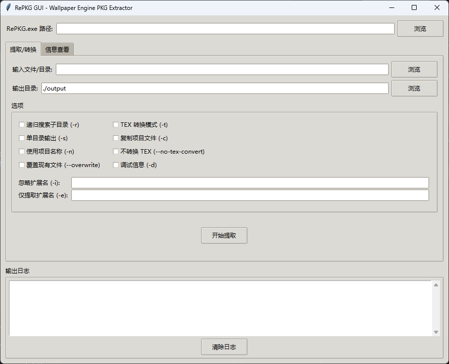

# RePKG GUI - Wallpaper Engine壁纸提取器

一个基于Python和tkinter的图形化界面工具，用于批量提取和转换Wallpaper Engine的壁纸文件。


## 📋 项目简介

RePKG GUI是一个用户友好的图形化工具，专门用于处理Wallpaper Engine的壁纸文件。它提供了一个直观的界面来调用[RePKG](https://github.com/notscuffed/repkg)工具，支持批量提取PKG文件和处理直接文件格式的壁纸。

### ✨ 主要特性

- 🖥️ **图形化界面** - 简单易用的GUI界面，无需命令行操作
- 📦 **批量处理** - 支持批量提取Steam Workshop中的所有壁纸
- 🔄 **双格式支持** - 同时支持PKG文件和直接文件格式
- 📊 **实时进度** - 显示处理进度和详细日志
- 🎯 **智能识别** - 自动识别壁纸类型并选择合适的处理方式
- 📝 **项目信息** - 从project.json提取项目名称作为文件夹名
- ⚙️ **丰富选项** - 支持RePKG的所有命令行选项

## 🎯 支持的文件格式

### PKG文件格式
- ✅ 标准的Wallpaper Engine PKG格式
- ✅ 自动解包并转换TEX文件为图像
- ✅ 提取所有资源文件

### 直接文件格式
- ✅ 包含project.json的目录
- ✅ 视频壁纸（.mp4, .webm等）
- ✅ 静态图片壁纸
- ✅ 网页壁纸和其他格式

## 🚀 快速开始

### 前置要求

- Windows 10/11
- Python 3.7+ （如果从源码运行）
- [RePKG.exe](https://github.com/notscuffed/repkg/releases) 工具

### 方法1: 下载可执行文件（推荐）

1. 从[Releases](https://github.com/jiangdengke/repkg-gui-wallpaper-extractor/releases)页面下载最新的`RePKG-GUI.exe`
2. 下载[RePKG.exe](https://github.com/notscuffed/repkg/releases)
3. 运行`RePKG-GUI.exe`

### 方法2: 从源码运行

```bash
# 克隆仓库
git clone https://github.com/jiangdengke/repkg-gui-wallpaper-extractor.git
cd repkg-gui-wallpaper-extractor

# 运行程序
python repkg_gui_batch.py
```

## 📖 使用说明

### 1. 基本设置

1. 启动程序后，首先点击"浏览"按钮选择`RePKG.exe`文件的位置
2. 程序会自动设置Steam Workshop的默认路径

### 2. 单个文件提取

在"单个提取"选项卡中：
- 选择要提取的PKG文件或TEX文件
- 设置输出目录
- 根据需要调整选项
- 点击"开始提取"

### 3. 批量提取（推荐）

在"批量提取"选项卡中：
- 确认Steam Workshop目录路径（通常是`C:\Program Files (x86)\Steam\steamapps\workshop\content\431960`）
- 设置批量输出目录
- 选择处理选项：
  - ✅ 处理PKG文件
  - ✅ 处理直接文件目录
  - ✅ 使用项目名称作为文件夹名
- 点击"扫描目录"查看可处理的项目数量
- 点击"开始批量提取"

### 4. 查看文件信息

在"信息查看"选项卡中：
- 选择PKG文件
- 查看包含的文件列表和项目信息

## 🖼️ 界面预览



## 🛠️ 构建可执行文件

如果你想自己构建exe文件：

```bash
# 安装依赖
pip install pyinstaller

# 构建exe文件
pyinstaller --onefile --windowed --name "RePKG-GUI" repkg_gui.py

# 生成的exe文件位于 dist/ 目录
```


## 🔧 配置选项

### 提取选项
- **递归搜索** (`-r`): 搜索子目录
- **TEX转换模式** (`-t`): 专门处理TEX文件
- **单目录输出** (`-s`): 将所有文件放在一个目录中
- **复制项目文件** (`-c`): 复制project.json和预览图
- **使用项目名称** (`-n`): 使用项目名称作为文件夹名
- **不转换TEX** (`--no-tex-convert`): 保持TEX文件原格式
- **覆盖文件** (`--overwrite`): 覆盖已存在的文件

### 过滤选项
- **忽略扩展名** (`-i`): 跳过指定扩展名的文件
- **仅提取扩展名** (`-e`): 只提取指定扩展名的文件


## 🤝 贡献

欢迎贡献代码！请遵循以下步骤：

1. Fork本项目
2. 创建特性分支 (`git checkout -b feature/AmazingFeature`)
3. 提交更改 (`git commit -m 'Add some AmazingFeature'`)
4. 推送到分支 (`git push origin feature/AmazingFeature`)
5. 创建Pull Request

## 📝 更新日志

### v1.0.0 (2025-07-04)
- 🎉 初始版本发布
- ✨ 支持PKG文件和直接文件格式的批量提取
- 🖥️ 用户友好的GUI界面
- 📊 实时进度显示和详细日志
- 🔧 丰富的配置选项

## 🐛 问题反馈

如果你遇到问题或有建议，请：
1. 查看[Issues](https://github.com/jdkzwl/repkg-gui-wallpaper-extractor/issues)页面
2. 创建新的Issue描述问题
3. 提供详细的错误信息和截图

## 📄 许可证

本项目基于MIT许可证发布 - 查看[LICENSE](LICENSE)文件了解详情。

## 🙏 鸣谢


<div align="center">
  
  <br>
  <b>特别感谢 <a href="https://www.jetbrains.com/">JetBrains</a> 为开源项目提供免费的 IDE 授权</b>
</div>


## 📞 联系方式

- GitHub: [@jiangdengke](https://github.com/jiangdengke)
- Issues: [项目Issues页面](https://github.com/jiangdengke/repkg-gui-wallpaper-extractor/issues)

---

⭐ 如果这个项目对你有帮助，请给个Star支持一下！